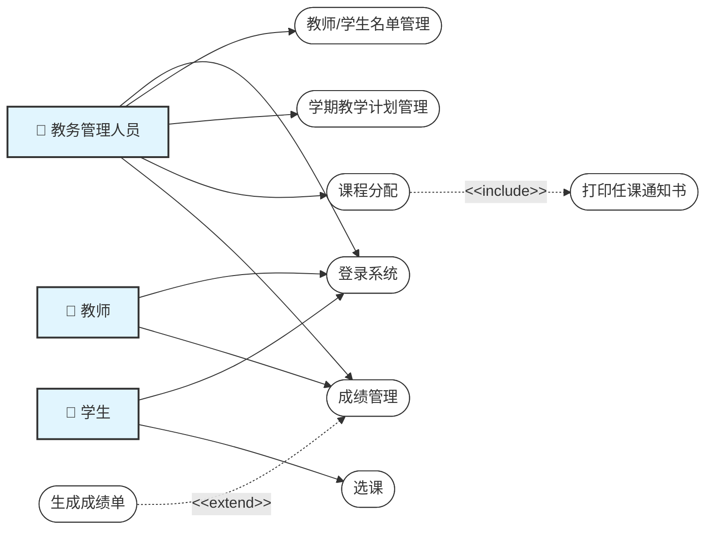

```mermaid
graph LR
    %% 设置样式：将节点变成椭圆（模拟用例）和方块（模拟角色）
    classDef usecase fill:#FFF,stroke:#333,stroke-width:1px,rx:20,ry:20;
    classDef actor fill:#E1F5FE,stroke:#333,stroke-width:2px;

    %% --- 1. 定义角色 (用方块代替小人) ---
    Admin[👤 教务管理人员]:::actor
    Teacher[👤 教师]:::actor
    Student[👤 学生]:::actor

    %% --- 2. 定义用例 (用圆角矩形/椭圆代替) ---
    %% 格式：ID([文字内容]):::usecase
    UC_Login([登录系统]):::usecase
    UC_List([教师/学生名单管理]):::usecase
    UC_Plan([学期教学计划管理]):::usecase
    UC_Assign([课程分配]):::usecase
    UC_Print([打印任课通知书]):::usecase
    UC_Grade([成绩管理]):::usecase
    UC_Report([生成成绩单]):::usecase
    UC_Select([选课]):::usecase

    %% --- 3. 连线关系 ---
    
    %% 教务的连线
    Admin --> UC_Login
    Admin --> UC_List
    Admin --> UC_Plan
    Admin --> UC_Assign
    Admin --> UC_Grade

    %% 教师的连线
    Teacher --> UC_Login
    Teacher --> UC_Grade

    %% 学生的连线
    Student --> UC_Login
    Student --> UC_Select

    %% --- 4. 关键得分点 (虚线关系) ---
    
    %% 包含关系：虚线箭头 + include文字
    UC_Assign -.->|&lt;&lt;include&gt;&gt;| UC_Print

    %% 扩展关系：虚线箭头 + extend文字
    %% 注意：在graph语法中，标签不支持直接用<>，所以用HTML转义字符
    UC_Report -.->|&lt;&lt;extend&gt;&gt;| UC_Grade
```

```mermaid
graph TB
    %% --- 样式配置 ---
    %% 强制将节点设为圆角矩形，模拟状态
    classDef state fill:#FFFFFF,stroke:#333,stroke-width:1.5px,rx:10,ry:10,text-align:left;
    %% 实心黑点样式（初态）
    classDef start fill:#000,stroke:#000,stroke-width:1px,min-width:15px,min-height:15px,max-width:15px,max-height:15px;

    %% --- 节点定义 ---
    %% 使用 HTML 标签 <br/> 和 --- 来模拟状态图内部的分割线
    Start(( )):::start
    
    %% 核心状态
    S_Monitor["<b>监护中</b><br/>---<br/>do/接收生理信号"]:::state
    
    %% 分支状态
    S_Log["<b>记录日志</b><br/>---<br/>entry/记录病人情况"]:::state
    S_Warn["<b>报警</b><br/>---<br/>entry/向护士发出警告"]:::state
    S_Print["<b>打印报告</b><br/>---<br/>entry/打印指定报告"]:::state

    %% --- 连线逻辑 ---
    
    %% 1. 初始化
    Start --> S_Monitor

    %% 2. 记录循环 (放在左侧)
    S_Monitor -- "定时时间到" --> S_Log
    S_Log -- "记录完成" --> S_Monitor

    %% 3. 报警循环 (放在中间/下方)
    S_Monitor -- "生理信号超出范围" --> S_Warn
    S_Warn -- "恢复正常/确认" --> S_Monitor

    %% 4. 打印循环 (放在右侧)
    S_Monitor -- "护士请求打印" --> S_Print
    S_Print -- "打印完成" --> S_Monitor
```

