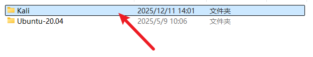
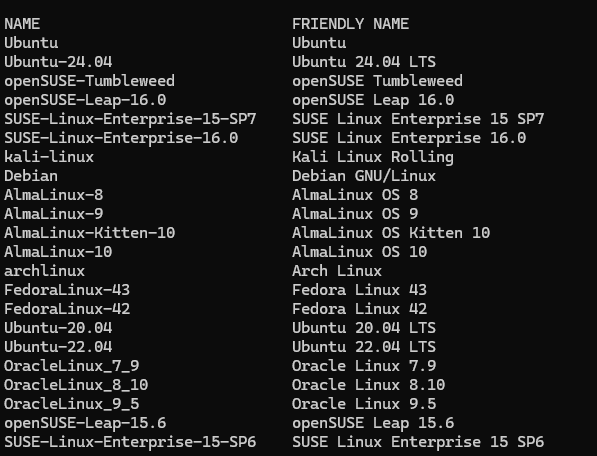
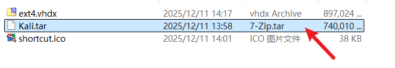
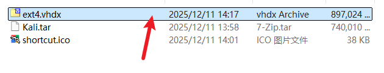
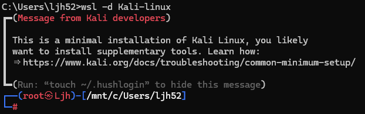
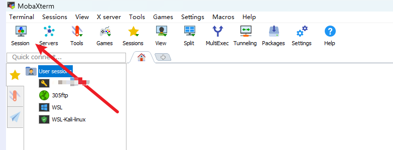
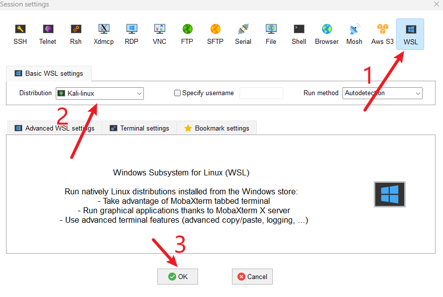
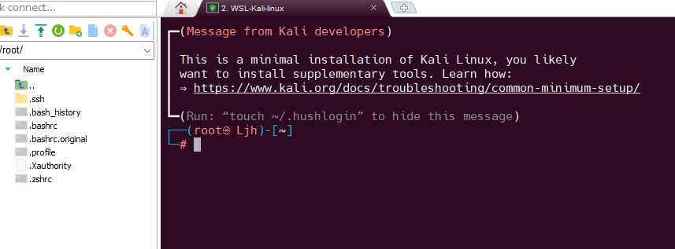

#### 1.在E:\wsl中创建一个Kali目录

#### 2.列出所有wsl发行版
```shell
wsl  --list --online
```

#### 3.下载Kali-linux镜像
```shell
wsl --install -d Kali-linux
```
#### 4.导出为Kali.tar文件到E:\wsl\Kali目录下
```shell
wsl --export  Kali-linux E:\wsl\Kali\Kali.tar
```

#### 5.取消注册原有的Kali-linux
```shell
wsl --unregister Kali-linux
```
#### 6.导入Kali-linux到E:\WSL\Kali
```shell
wsl --import Kali-linux E:\WSL\Kali E:\WSL\Kali\Kali.tar --version 2
```

#### 7.启动Kali-linux
```shell
wsl -d Kali-linux
```

#### 8.MobaXterm连接WSL


